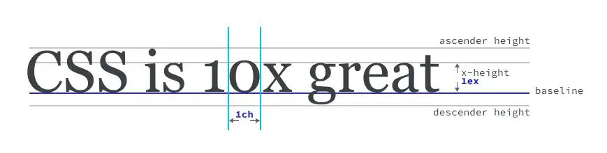

## CSS Inheritance 

在 CSS 中，文字段落相关样式会继承父组件样式，盒模型相关样式则不会继承。
* 文字相关： `color, font-size, font-family, font-weight, line-height, text-align, letter-spacing, word-spacing`
* 盒模型相关不继承：`width, height, margin, padding, border, postiion, flex, grid`

在 HTML/CSS 模型中，段落间距和页间距通过盒模型控制，没有专门样式。

## sizing

* 字符高度单位 `width: 1.2em`: 相对于当前正文字号的比例
* 百分比 `width: 40%`, `width: 0.4`: 继承父组件的百分比比例
* 印刷排版单位 `width: 70pt`: 大概相当于 `1/72 inch`, 对应固定的（绝对长度的）尺寸
* 屏幕排版单位 `width: 800px`: 大概相当于 `1/96 inch`, 是一种参考尺度，具体决定于屏幕渲染参数

### 印刷排版 (PDF)

### 网页排版 

Absolute: 
| Unit | Name | Equivalent to |
| ----- | --- | ------------- |
`cm` | Centimeters | `1cm = 96px/2.54` 
`mm` | Millimeters | `1cm = 1/10th of 1cm`
`inch` | Inches (En) | `1in = 2.54cm = 96px` 
`pc` | Picas | `pc = 1/16 of in`
`pt` | Points | `pt = 1/74th of in`

Relative Units:
* `em` font-size relative to its parent 
* `rem` font-size relative to root element 
* `ex` Heuristic to determine whether to use the x-height 
* `cap` Height of capital letters in current font-size
* `ch` character width of a narrow glyph (`0`)
* `ic` character width of a full-width glyph (`水`)
* `lh` line height of the element 

Viewport-Relative Units:
* `vw` 1% of viewport's width 
* `vh` 1% of viewport's height 
* `vi` 1% of viewport's size in the root element's inline axis 
* `vb` 1% of viewport's size in the root element's block axis

## paragraph distance 
