# 成像原理

## Perspective

Common assumptions:
1. light leaving an object travels in straight lines
2. These lines converge to a point at the eye
3. More distant objects subtend smaller visual angles

Vanishing point:

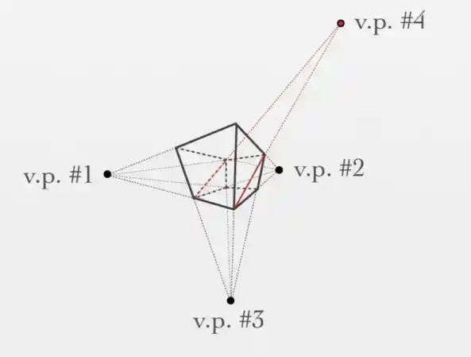

## Focal Length

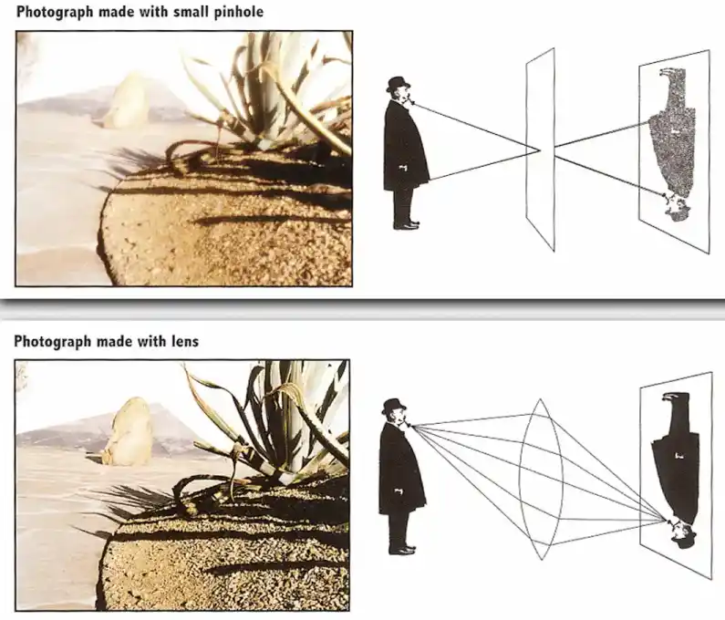

In a *pinhole model*, each 3D points is presented by essentially one ray passing through the camera center;
In a *lens/glass model*, Many rays from the same 3D point enter the lens, are refracted, and ideally converge onto
point on the sensor.

Pinhole selects rays, with very low light intake and no fucusing system.
But pinhole model can have very large _depth of field (景深, DOF)_, and ideally no optical distortion.

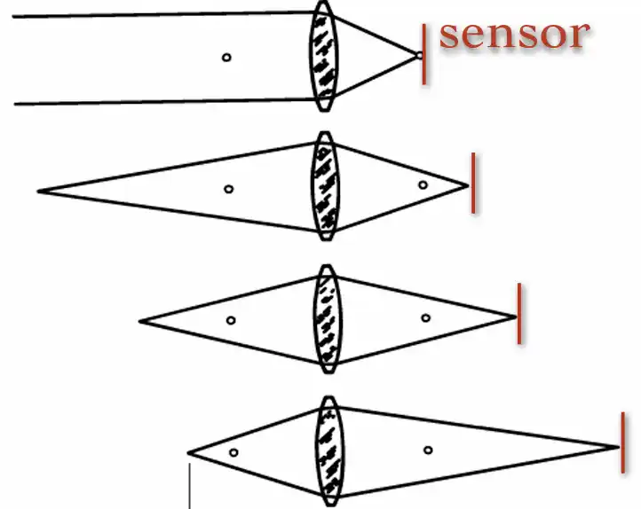

To focus on objects at different distances, move sensor relative to lens. 像手机镜头，_焦距 (focal length)_ 很短，
景深天然很大，即有很长距离看起来清晰，没有那么强的失焦虚化感，但不等于清晰或锐度高了。

## FOV (Field of View)

视场角由焦距和传感器大小（底片大小）共同决定。更大的底片，更小的焦距，得到更宽的视角。
The lens creates an image projection, while the sensor size determines how much of that
projection is captured.

$$ 
\text{FOV} = 2 \arctan(\frac{d}{2f})
$$


传感器尺寸参数通常有几种选择：

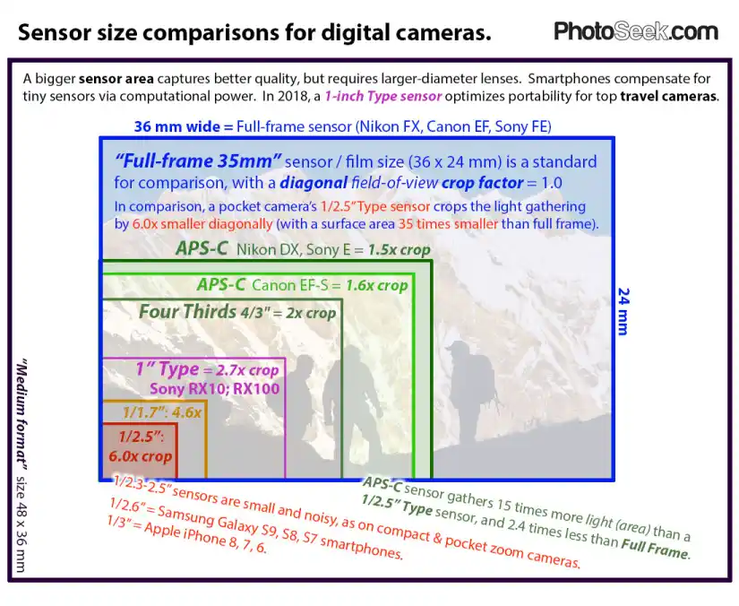

其中，_全画幅 (Full Frame)_ 是指接近传统 35mm 胶片尺寸的传感器，并不是最大的画幅。其他画幅：
- _APS-C_ 约 `24x16mm` ，裁切系数大概 1.6x ，一般用于入门相机
- _Micro 4/3_ 约 `17x13mm` ，裁切系数 2x ，小巧，等效长焦
- _Medium Format_ `44x33mm` ，更大的成像面，景深更深，动态范围更高，也昂贵。


_Crop Factor (裁切系数)_ 是指某个传感器尺寸相对于全画幅的比例，用于衡量传感器在视场角上的裁切长度。
定义为：

$$
\text{Crop Factor} = \frac{\text{Full-frame diagonal}}{\text{Sensor diagonal}}
$$

## Exposure

### Shutter

_快门 (Shutter)_ 控制曝光时间。快门速度慢，进光多，但是容易**产生运动模糊**。 
光圈控制总进光口多大。光圈越大，进光越多，背景约容易虚 （景深浅）

$$
\text{Exposure} \approx \text{Exposure time} \times \text{Aperture size}
$$

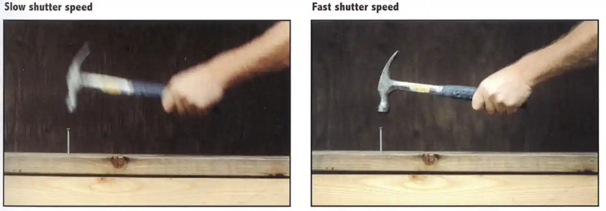

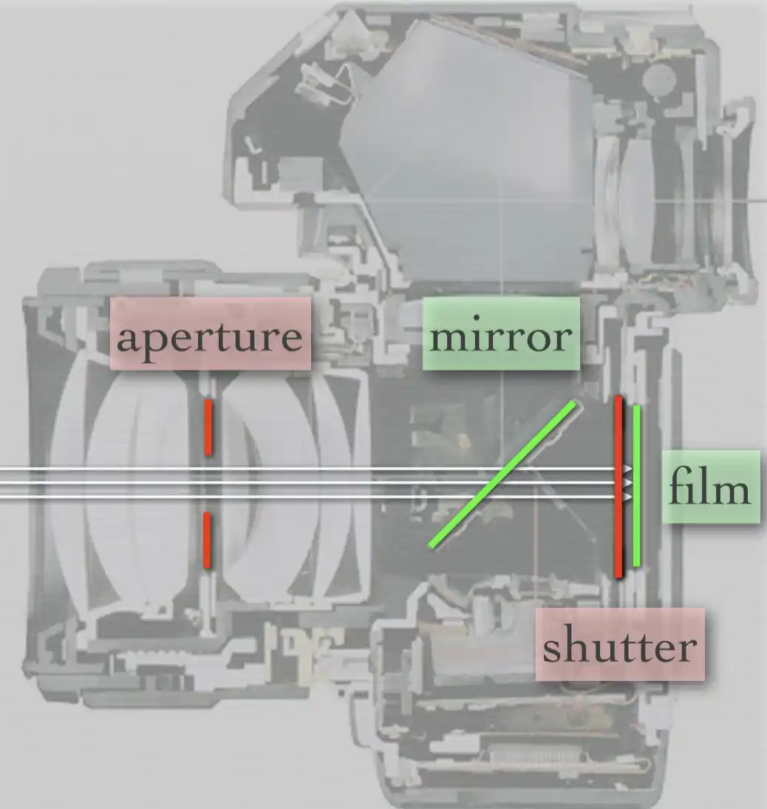

### Aperture

在衡量 _光圈 (Aperture)_ 大小参数时，不直接用光圈的物理直径，而用 _入瞳 (entrance pupil)_ 直径。
入瞳是指从物体一侧看去，光圈被镜片映射到多大，这实际反映了镜头允许多大的光束进入。

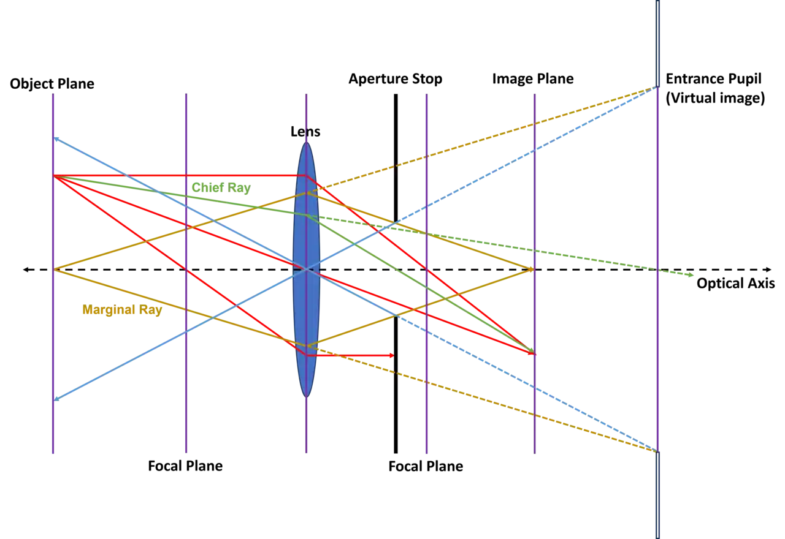

在光圈参数 `D = f/N` 中，$D$ 是入瞳直径。最终进光量正比于 $D^2$ ，这意味，每一档光圈让
进光量增加 2 倍，直径应该增加 $\sqrt{2}$ 倍。因此常见的光圈挡位为：

```
f/1  f/1.4  f/2  f/2.8  f/4  f/5.6  f/8  f/11
```

物体不在镜头焦点上，就会在传感器形成一个小圆斑，只要其不过大，画面中物体就仍看起来清晰。
也就是说焦点前后会有一个 *近景景深界限* 和一个 *远景景深界限*。

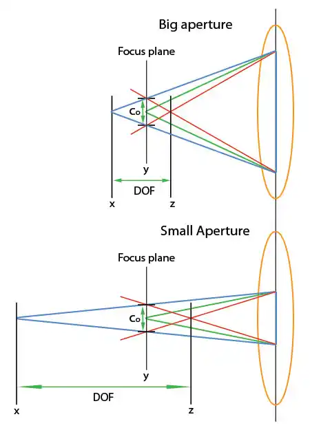

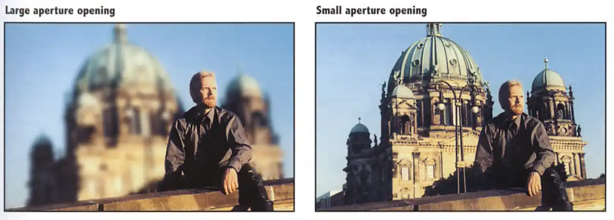


### ISO

ISO 则是传感器对光信号的增益（敏感）程度，增益小时，画面干净但是需要更多光线；
增益大时，画面更亮，但噪点多，动态范围差。

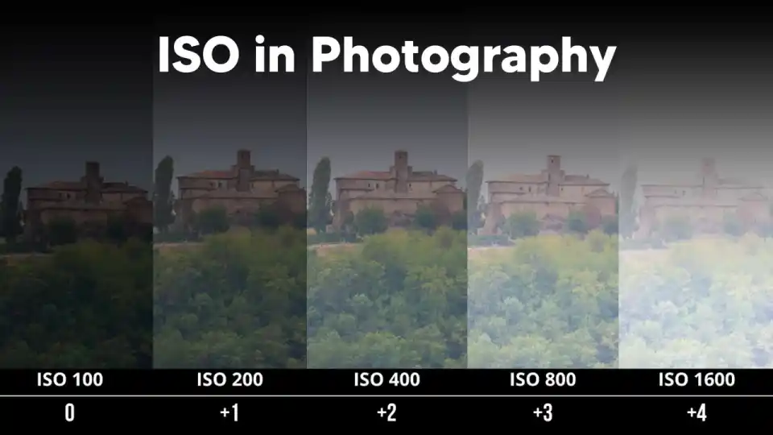

### 典型场景

场景 | 光圈 | 快门 | ISO |  |
|----- |------|-----|------| ---|
凝固运动 | f2.8 | 1/1000s | ISO 400 | 用快快门，然后开大光圈补光。
背景虚化（人像）| f/1.8 | 1/500s | ISO 100 | 大光圈，适合焦距大概 50mm/85mm 的人像 
流水拉丝 | f/8 | 1/2s | ISO 100 | 慢快门，同时缩小光圈。用三脚架提供焦点稳定 [^1]
分镜前后都清晰 | f/8 | 1/125s | ISO 100 | 缩小光圈，再降低快门速度

[^1]: 快门速度一般是等效焦距的倒数，焦距越长，对快门防抖要求越高。


# Camera

SLR (Single lens reflex camera, 单反相机)


<figure>
    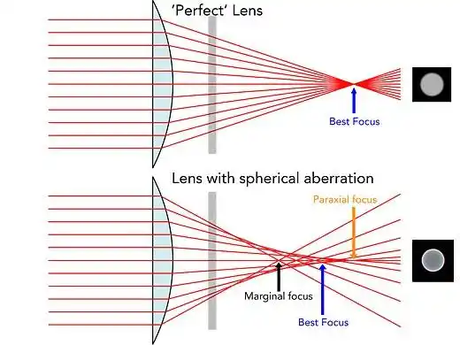
  <figcaption>
    Source: <a href="https://www.dpreview.com/articles/1449146848/closer-look-canon-rf-100mm-f2-8l-macro-is-usm">OpenStax</a>
  </figcaption>
</figure>


理想条件下凸镜才有焦点，一般光学中还分为近轴焦点 (paraxial focus)、边缘光焦点、最佳焦点和各种像差。

<figure>
  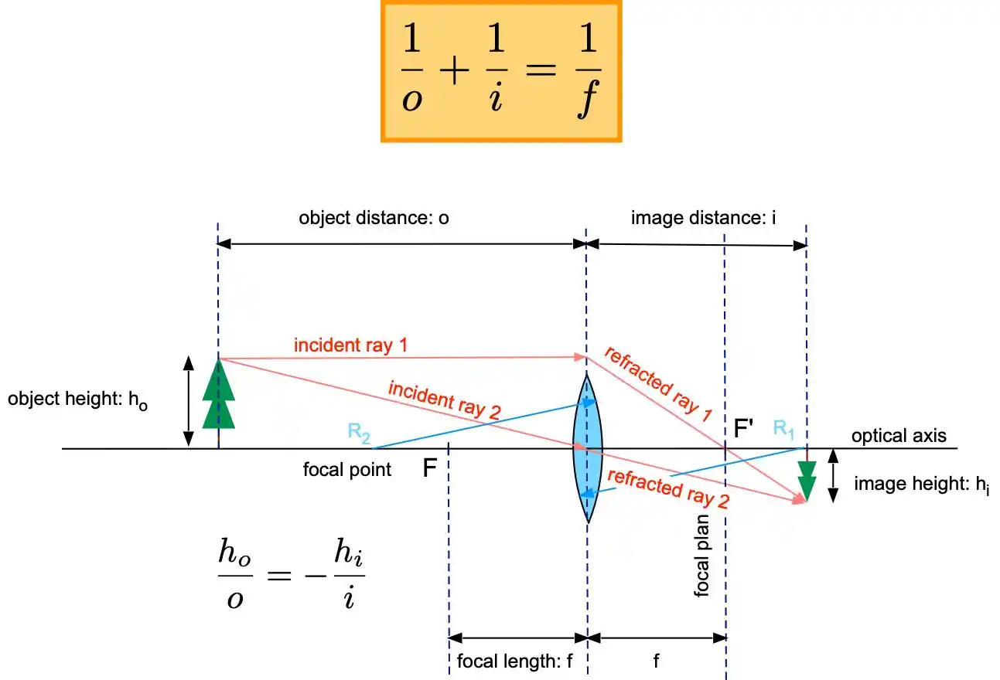
  <figcaption>Source: <a href="https://wanda.fiu.edu/boeglinw/courses/Modern_lab_manual3/optical_instruments.html">Modern Lab Experiments 17.</a></figcaption>
</figure>

## 

## Exposure

* 快门 (速度, shutter speed)
* 光圈 (aperture)
* ISO

## Lighting

## Perspective 

## Color Grading 
