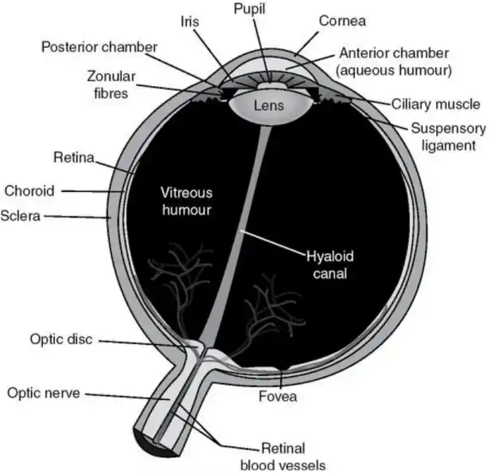
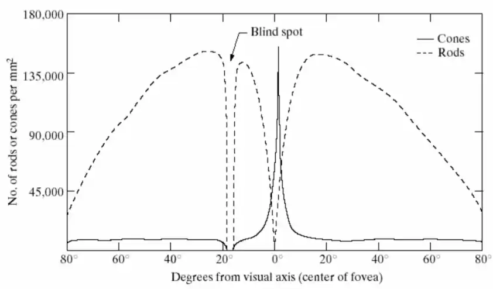

# MultiMedia

* Text
* Audio
* Image
* Video
* Animation

# Sensors

## Camera 

成像相关知识见 [imaging/photography](./imaging/photography.md)

CMOS vs. CCD 

Stereo Camera

3D ToF (Time-of-Flight) Sensor

Retina (视网膜) is covered by light receptors (i.e., cones & rods, 视锥细胞、视杆细胞),
* cones: 6~7 millions, located in central (circular) portion of retina, highly sensitive to color
* robs: 75+ millions, distributed over retinal surface, giving a general picture of field of view

人眼的大概参数：
* 等效焦距: 20mm,
* 中心视野像素: 500m pixels,
* 光圈: f/2.1~f/8.3. 通过虹膜 (iris) 调节
* 快门大概 50~90 Hz , 连续采样、中心视野不断跳动、大脑补帧渲染

相机的曝光
* ISO 
* 光圈
* 快门

相机的焦距

安全的快门一般是等效焦距的倒数，焦距越长，快门防抖要求越高。

相机的景深，高景深的条件：
* 位置关系
* 光圈大小
* 实际的焦距

## Earpiece 

* Sounde Presure Level (SPL)
* Reverberation
* Microphone: Polar Pattern 

## Speaker

# Small AI Tasks 

## 视觉任务

* 图像分类、物体识别 
* 目标检测 
* 运动检测，姿态估计
* 人脸识别

## 音频任务

* 语音活动检测（VAD）：检测是否有人说话
* 唤醒词检测（KWS）：Hei Siri 
* 声音事件检测
* 声纹识别 

## 文本任务（非 LLM）

* 翻译（LLM 前身）
* 文本分类
* 用户意图识别

## 传感器与时许任务

* 运动活动识别 （走路、跑步、静止）
* 跌倒检测 
* 手势识别（IMU 识别首部动作）

