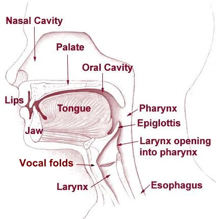

## Acoustics

Sound is a mechanical wave produced by vibrations.

*Decibels (dB)* is a log unit expressing the ratio between two quantities, rather than an absolute 
value. Sound Pressure Level (SPL):

$$
L_p = 20 \log_{10}(\frac{P_1}{P_0})
$$

* $P_1$ root-mean-square sound pressure, in `Pa`
* $P_0 = 20 \mu Pa$ standard reference pressure in air 

So, +3dB will twice the sound intensity, +6dB will twice the sound pressure amplitude.

## Speech Production

<figure>
  
  <figcaption>Source: <a href="https://speechprocessingbook.aalto.fi/introduction/speech-production-and-acoustic-properties/">@tom2022</a></figcaption>
</figure>

人体说话时，肺部发出气流，带动*声带 (vocal folds)* 震动，产生基础音高语调。
接着，气流经过声道（咽腔 pharynx, 口腔 oral cavity, 鼻腔 nasal cavity) 产生一些频谱改变和偏移，最终发出声音。

* 声带震动 (oscillation) 产生基频 (F0, Fundamental Frequency)，也叫浊音 (Voiced Speech) 
* 声道共振 (resonance) 产生共振峰 (F1 / F2, Formants)，产生清音 (unvoiced)

F0 越高，声音*音高 (pitch)* 越高。以吉他拨弦为例，拨弦更用力，只影响声音的响度；只有弦本身更紧，
才能产生更高的频率，音高升高。
